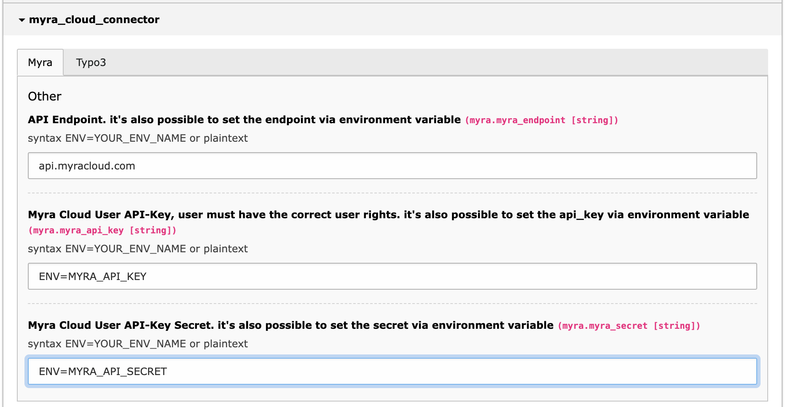
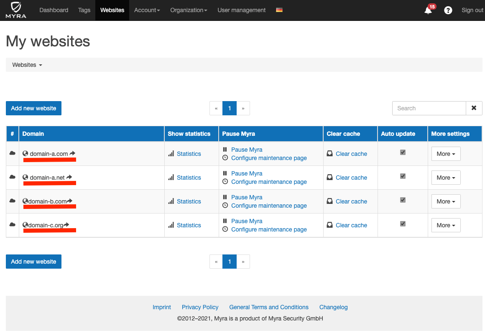

===============
Extension Setup
===============

Most settings are made in

``Admin Tools > Settings > Extension Configuration > cps_myra_cloud``

Use of environment variables
---------------------

Configuration values can be set as text or parsed from environment values

Every config that start with ``ENV=`` will be parsed and the provided environment variable will be used.

Example syntax:

``ENV=MYRA_API_KEY # results in getenv('MYRA_API_KEY')``

Myra Settings
-------------

Myra API setup

Myra API Endpoint
~~~~~~~~~~~~~~~~~

The MyraCloud API endpoint for every request.

Myra API Key
~~~~~~~~~~~~

a MyraCloud User API KEY (who has the permissions to clear the domain).

Myra API Secret
~~~~~~~~~~~~~~~

the matching Secret for the API-key.

TYPO3 Site Settings
~~~~~~~~~~~~~~~~~~~

To link TYPO3 with MyraCloud it's necessary to announce the used MyraCloud Domains for a TYPO3 Site Entity.

``Site Management > Edit [SiteXYZ] > MyraCloud > Myra Domain List``

This is a comma separated list of all Myra domains, this particular site supports. You can find the correct names in MyraSecurity Backend under myrasecurity.com.

