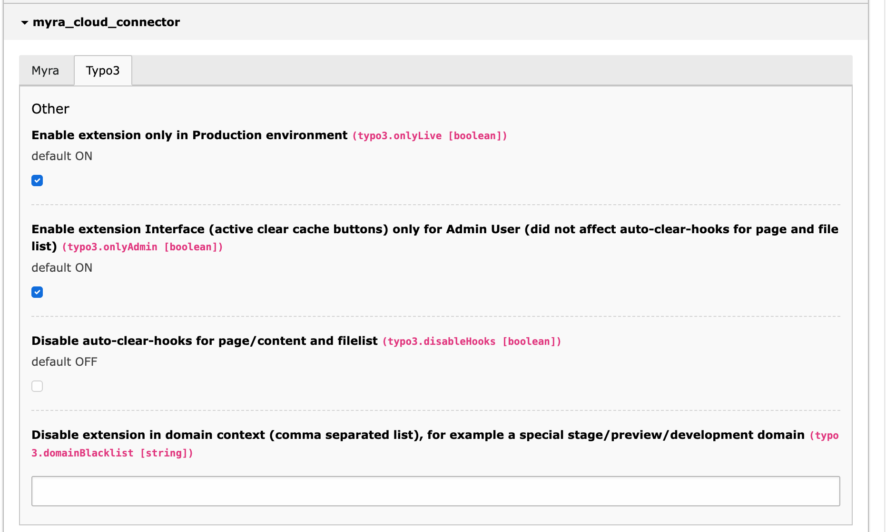

==============
TYPO3 Features
==============

Toggle TYPO3 features.

.. _production-only:
Production only
~~~~~~~~~~~~~~~

If checked, this prevents any Myra Cloud clear request and disables all UI elements if the applicationContext is not "Production".
This is useful to prevent clear requests from stage or development instances.

.. _admin-only:
Admin Only UI Elements
~~~~~~~~~~~~~~~~~~~~~~

If checked, all UI Elements are disabled for non-admin users.

.. note::
    AutoClear hooks (Page update / FileList replace) are not affected by this.

.. _disable-hooks:
Disable Hooks
~~~~~~~~~~~~~

If checked, both AutoClear hooks (Page update and FileList replace) are disabled.

.. _domain-blacklist:
Domain Blacklist
~~~~~~~~~~~~~~~~

A comma separated blacklist of Domain names, prevents any Myra Cloud clear request and disables all UI alements if TYPO3 is used from a domain in this list.

.. note::
    This does not affect the CLI command.
