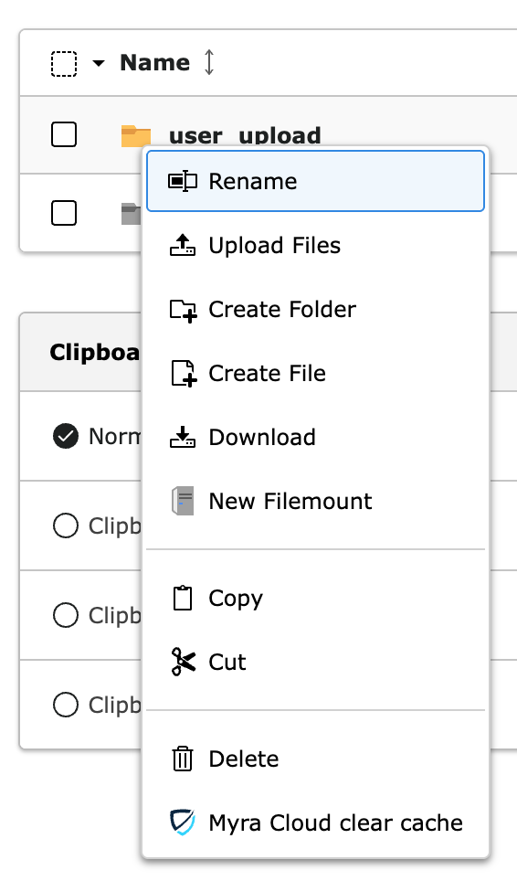

===========
Clear files
===========

There are 4 ways to clear files from the cache:

-  Backend CacheMenu (clear all)
-  Context Menu in FileTree (right-click)
-  Options Menu in FileList
-  FileList Update Hook

The FileTree clear-cache commands on folders are recursive.

.. _cachemenu-files:
Backend CacheMenu
-----------------

.. image:: ../img/cacheMenu.png
    :alt: The TYPO3 cache menu showing additional myra cache options to delete all files or all pages.

This option is admin-only by default. To allow for non-admin users, set user permissions accordingly.

If the menu option does not appear, check for missing Myra credentials and the setting of the feature flags:

-  :ref:`Admin only<_admin-only>`
-  :ref:`Production only<_production-only>`
-  :ref:`Domain blacklist<_domain-blacklist>`

.. _contextmenu-filetree:
Context menu in FileTree
------------------------

.. image:: ../img/context_filetree.png
    :alt: view of FileTree context menu showing Myra Clear Cache option

This will clear all files from the selected directory and all its subdirectories recursively.

.. _optionsmenu-filelist:
Options Menu in FileList
------------------------

This will clear the selected file only.

See also
=========

:ref:`AutoClear on file replace <_file-replace-hook>`
