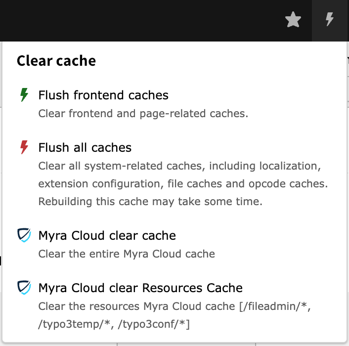
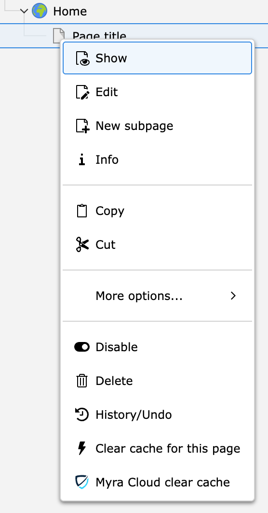
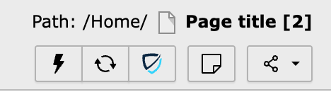

===========
Clear pages
===========

There are 4 ways to clear a page from the cache:

-  Backend CacheMenu (clear all pages)
-  Context Menu in PageTree (left/right-click)
-  ButtonBar in Menu in Page/List/View
-  Page/Content Update Hook

Apart from clear-all, the page clear-cache options clear a single page
and are non-recursive.

.. _cachemenu-page:
Backend CacheMenu
-----------------

Clear the entire page cache or file cache

This option is admin-only by default. To allow for non-admin users, set user permissions accordingly.

If the menu option does not appear, check for missing Myra credentials and the setting of the feature flags:

-  :ref:`Admin only<_admin-only>`
-  :ref:`Production only<_production-only>`
-  :ref:`Domain blacklist<_domain-blacklist>`

.. _contextmenu-page:
Context Menu in PageTree
------------------------

This will clear the selected page only (no child pages). The option will not clear file resources.

.. _buttonbar-page:
ButtonBar
---------

This will clear the current page only (no child pages). The option will not clear file resources.

See also
=========

:ref:`AutoClear on page / content changes <_page-update-hook>`

